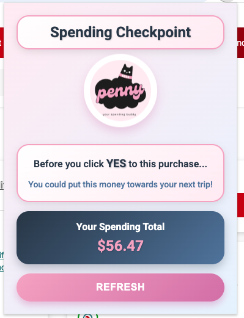
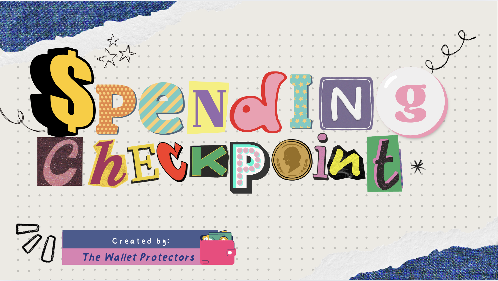

# Spending Checkpoint

We live in a time when digital innovations have given rise to technologies and processes that redefine our wants into needs for instant gratification. In this era, ecommerce companies have arguably won the marketing race in understanding how to turn the most logical humans into rampant consumers. Combined with daily stressors of work/family and we have the perfect environment for impulse internet shopping.

# Problem

People need to slow down when they find themselves "taking advantage of this great deal!". At this point, the item(s) have already been added to their shopping carts. Check out button(s) are even presented at multiple spots on the web page to make the instant gratification a reality. This is where the chrome extension will slow down the process.

# Target Users

Chrome users who shop when experiencing any of the following: heightened stress, heightened emotional state (ex: anger, sadness, frustration), boredom, mentally altered states (such as alcohol consumption).

# Solution

Meet Penny, your shopping buddy that helps you mentally checkin before you complete your online purchase. Before you complete a purchase, Penny will pop up to check in on you before you complete your checkout. She will notify you how much you're about to spend and remind you of your goals and potential savings by not ordering your items.

Penny isn't here to shame you, she's here to help you checkin with your mental state and lead you to other solutions that can make you happy while keeping your financial goals in mind.

# Goals

<ul>
<li>Offers non judgemental pause to impulse purchases</li>
<li>Presented using non-offensive cartoon like characters</li>
<li>Helps consumer slow down the instant gratification for a moment (or two) before proceeding or abandoning the cart</li>
</ul>

# IceBox Features

<ul>
<li>🌟 Adding a "reward" notice when purchase is not made. Ex: "The non-purchase means you have an extra $25 towards your vacation savings!" [labor calculator]</li>
<li>⏱ Timer function where the extension is only activated during peak impulse shopping hours. Ex: From 1900-0200 may be the times most likely for impulse shopping</li>
<li>🌐 Available in other popular browswers such as Firefox</li>
</ul>

# How to Add Extension

Check out the Chrome Extension here! - Link (need link or don't share)?

# Technologies Used

   

# Interested in reading more this project?

<a href="https://www.canva.com/design/DAG4mzJff6s/dS91hlC80IDlTvKgyxLsmA/view?utm_content=DAG4mzJff6s&utm_campaign=designshare&utm_medium=link2&utm_source=uniquelinks&utlId=h5c40615556">Checkout the presentation deck!</a>

# Team Members

<ul>
<li><a href="https://github.com/AinslieF ">Ainslie Francis</a></li>
<li><a href="https://www.linkedin.com/in/acooperrpi/">Ann Cooper</a></li>
<li><a href="https://github.com/Babz-G">Babz Gaynor</a></li>
<li><a href="https://github.com/darithedev">Dari Caceres</a></li>
<li><a href="https://github.com/ggrossvi">Gloria Villa</a></li>
<li><a href="https://github.com/kscott2016">Krystina Bradley</a></li>
<li><a href="https://github.com/ziamah">Maham Zia</a></li>
<li><a href="https://github.com/ongmars">Marilyn Ong</a></li>
<li><a href="https://github.com/meganirenegott">Megan Gott</a></li>
<li><a href="https://www.linkedin.com/in/vien-yadavongsy/">Vien Yadavongsy</a></li>
</ul>

# FAQs

<strong>What is the Spending Checkpoint?</strong>
  

Spending Checkpoint is a chrome browser extension that helps users be more mindful during online purchases.  By popping up a mindfulness reminder at the checkout screen, users are encouraged to take a moment and think through their purchase and if this is money they want to spend in the moment or save towards a larger goal.

<strong>Why did your team create the Spending Checkpoint?</strong>
 

Very smart humans have worked incredibly hard to get consumers to spend money in as few clicks as possible.  By creating a “spending checkpoint,” the sales funnel is mildly interrupted to allow for reflection around if this shopping car is an intentional purchase or maybe shopping is being used to fill another human need.

<strong>Why does Spending Checkpoint ask users to set a money related goal? </strong>

Writing down goals makes them more real.  Maybe you want to go on a trip, or save up for something important to you.  By personalizing the spending checkpoint, the pop up is designed to encourage mindfulness that matters to you, regardless of whether or not you proceed with a purchase.  By asking users if this is money they’d like to apply towards their goal, they can better decide if this is an impulse purchase or if the money could be spend to something that feels more rewarding.

<strong>What is the labor calculator feature?</strong>

The average American worker makes $28/hr in 2025.  By breaking down the total cost of your shopping cart into a labor per minute calculation for an average American, the spending checkpoint is offering another way to look at your money and the cost you pay in time and labor for the items in your cart.

<strong>Why the average American wage vs. a customized hourly wage calculator?</strong> 
 
This has been a question the Spending Checkpoint team has reflected on throughout the design and creation process.  Shame is a powerful tool to get people to spend money.  We at the Spending Checkpoint don’t want that to be a part of our product. 

